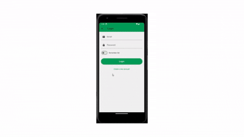

# VoltMart - Flutter E-Commerce App

## 🚀 Overview

VoltMart is a modern e-commerce app built with Flutter. It provides a smooth shopping experience, including product listings, categories, theme toggle, and product detail views. The app uses:

- `Provider` for state management
- `SharedPreferences` for saving user preferences
- A backend API for products and categories

---

## ✨ Features

- **Dynamic Home Screen**: Banners, featured products, categories, new arrivals
- **Theme Toggle**: Light/dark mode with sun/moon icon
- **Product Details**: Tap a product to view more info
- **Search**: Find products by name
- **Category Browsing**: View products by category
- **User Greeting**: Shows user’s name or "Guest"

---

## 🎥 Demo Video

[Watch Demo](https://drive.google.com/drive/folders/1NKjQO1yeGN2If2-2s5SmakL0TEmdghAy?usp=sharing)

preview with a GIF:



---

## 🛠 Installation

### Prerequisites

- Flutter SDK 3.16.0 or higher
- Dart 2.18.0 or higher
- Android Studio or VS Code
- Backend API available at `AppConstants.apiBaseUrl`

### Setup Steps

1. **Clone the Repository**
   ```bash
   git clone hhttps://github.com/omniaEE/VoltMart---Flutter-E-Commerce-App
   cd volt-mart
   ```
